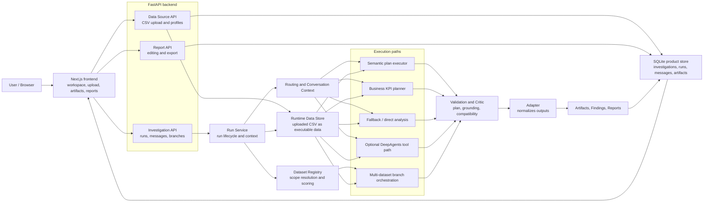

# Automated Data Analytics LLM Agent for Streamlining Business Operations

## Overview

Analytica is a deterministic analytical assistant designed for structured data exploration and KPI-oriented reasoning.

The project combines semantic planning, deterministic execution, validation mechanisms, artifact generation, and multi-dataset workflows into a single analytical workspace. Instead of relying entirely on free-form language-model generation, the system focuses on reproducible analytical execution and transparent intermediate outputs.

The prototype was developed as an engineering-oriented research project focused on practical analytical workflows, benchmark reproducibility, and controlled execution behavior.

---

## Main Idea

Analytica is built around a simple idea: language models should help interpret analytical intent, while deterministic services should compute the final numerical results.

The system first analyzes the user request and identifies the expected metric, aggregation type, grouping logic, filters, visualization intent, and dataset scope. After that, deterministic analytical modules execute the actual computations using dataframe operations and validated SQL workflows.

The workflow also includes validation and grounding checks that help detect common analytical problems such as missing fields, unsupported assumptions, incorrect dataset selection, or inconsistent outputs. Generated tables, charts, findings, and reports are stored as reusable analytical artifacts inside the investigation workspace.

LLM-based planning is configurable and can be enabled through optional semantic-planning or DeepAgents execution paths. However, the current benchmark evaluates only deterministic product execution workflows.

---

## Main Workflow

1. User uploads one or more datasets.
2. The system resolves analytical intent and dataset scope.
3. A deterministic analytical plan is constructed.
4. Analytical execution produces tables, charts, and KPI outputs.
5. Validation checks compare outputs against expected analytical constraints.
6. Results are stored as reusable analytical artifacts.
7. Final reports can be generated from validated outputs.

---

## Key Capabilities

### Dataset Handling

The current public workflow focuses on CSV-based dataset upload and profiling. Uploaded datasets are stored in a local runtime environment together with schema information, metadata summaries, categorical statistics, and numerical profiling results.

### Investigation Workspace

Analytica uses an investigation-oriented workflow where users can ask analytical questions, inspect intermediate outputs, continue follow-up exploration, and organize findings into lightweight reports.

### Deterministic Analytical Execution

The analytical backend supports grouped aggregations, distributions, trend analysis, relationship-style analysis, outlier inspection, and chart-oriented analytical workflows using deterministic dataframe execution.

### KPI and Business Reasoning

The system includes a business-semantic planning layer for KPI-oriented analysis tasks. The current implementation focuses mainly on retail-style analytical scenarios such as profit margin analysis, discount sensitivity, shipping-cost burden, and operational inefficiency patterns.

### Multi-Dataset Workflows

Analytica supports branch-based comparative reasoning across several datasets. Independent execution branches collect scoped evidence packages which are later combined into comparative summaries.

The current implementation focuses on comparative analytical workflows rather than arbitrary relational BI-style joins.

### Artifacts and Reporting

Analytical outputs are stored as reusable artifacts, including tables, charts, findings, and structured report sections. The prototype also supports lightweight TXT and PDF export workflows.

### Validation and Restricted Execution

The workflow includes plan validation, grounding checks, read-only SQL validation, and restricted dynamic Python execution.

The current execution model is application-level rather than OS-sandboxed. It relies on AST validation, restricted built-ins, limited imports, and tool-level restrictions.

### Configurable LLM Integration

LLM-assisted planning is configurable through external provider settings and local configuration files. Supported configurations include OpenRouter, Gemini, OpenAI-compatible APIs, and Ollama-style local models.

---

## Architecture



The frontend does not compute analytical results directly. It sends requests to the FastAPI backend. The backend creates or updates investigations, resolves datasets, runs analytical logic, validates outputs, stores results, and returns updated investigation state to the frontend.

CSV upload is the main public ingestion path. Uploaded files are stored under the configured upload directory, profiled, and converted into runtime data so that later analytical runs can use them.

---

## What Is Implemented

The current prototype includes a FastAPI backend together with a Next.js investigation workspace for analytical exploration and report-oriented workflows.

The backend supports investigation management, dataset upload, runtime execution, artifact storage, report generation, and lightweight persistence through SQLite-based product stores. Uploaded CSV datasets can be profiled and reused inside deterministic analytical workflows.

The frontend includes investigation pages, dataset-management views, upload workflows, chart and table artifacts, follow-up interaction, and report-oriented workspace components.

The analytical backend currently supports:
- deterministic dataframe-style execution;
- dataset scope resolution and dataset registry workflows;
- business-semantic KPI logic for selected schemas;
- read-only dataframe SQL tools;
- restricted dynamic Python execution;
- optional LLM-assisted and DeepAgents execution paths.

The repository also includes benchmark notebooks, evaluation outputs, and thesis visualization workflows used during the deterministic evaluation process.

---

## Current Limitations

The current public workflow focuses mainly on CSV-based analytical exploration. Database connectors, external APIs, and broader ingestion workflows are outside the current prototype scope.

The evaluation benchmark is relatively small and focuses on deterministic execution paths rather than live LLM behavior. Multi-dataset workflows are comparative and branch-based, not a full relational warehouse or SQL federation system.

Dynamic Python execution is restricted through application-level validation and limited execution controls, but the prototype is not designed as a hardened multi-tenant sandbox environment.

Follow-up analytical correction remains partial. Simpler incremental refinements can work reliably, while more difficult semantic overwrite cases may still fail.

The strongest analytical behavior currently appears in tested retail-style KPI workflows. More general healthcare and cross-domain semantic reasoning remains less stable.
---

## Project Structure

```text
source/api/
  FastAPI app, route registration, investigation routes, data-source routes, report routes.

source/product/
  Main product logic: run service, investigation service, dataset registry,
  planners, validators, executors, adapter, persistence interfaces, reports.

source/product/sqlite/
  SQLite product store implementation.

source/tools/
  DeepAgents tools for dataframe inspection, SQL validation/querying,
  safe Python analysis, chart helpers, and report artifacts.

source/agent.py
  Optional DeepAgents runtime setup and tool selection.

frontend/
  Next.js application with investigation workspace, upload UI, artifacts,
  report UI, API client, and frontend tests.

notebooks/
  Evaluation and thesis visualization notebooks.

docs/evaluation_outputs/
  Generated benchmark CSV, JSON, and figure outputs.

docs/thesis_figures/
  Figures used by the thesis report.
```
---

## Setup

### Requirements

- Python 3.12+
- Node.js 22 is used in the frontend Docker configuration. Local Node.js 18+ may also work for development.
- Docker and Docker Compose for containerized setup.

### Environment

Create a local environment file:

```bash
cp .env.example .env
```
---

## Running the Application

### Docker Compose

```bash
cp .env.example .env
docker compose up --build
```

Default URLs:

- Frontend: <http://localhost:3000>
- Backend API docs: <http://localhost:8000/docs>
- Health check: <http://localhost:8000/health>

### Local Backend

The backend dependencies are listed in `requirements.txt` and `pyproject.toml`.

```bash
python3 -m venv .venv
source .venv/bin/activate
pip install -r requirements.txt
uvicorn source.api.app:app --reload --host 0.0.0.0 --port 8000
```

### Local Frontend

```bash
cd frontend
npm install
npm run dev
```

For local frontend-to-backend calls, check `frontend/.env.example` and `frontend/lib/api.ts`.

## Evaluation

The project includes a deterministic benchmark for selected analytical workflows.

Evaluation notebooks:
- notebooks/evaluation_metrics.ipynb
- notebooks/thesis_visualizations.ipynb

Generated outputs:
- docs/evaluation_outputs/

The benchmark evaluates analytical correctness, KPI handling, visualization generation, follow-up behavior, and multi-dataset workflows on selected deterministic execution paths.

## Development Notes

### Backend Tests

The audited backend command used for non-integration tests is:

```bash
uv run --with pypdf pytest -q -m "not integration"
```

If dependencies are already installed in a virtual environment, the equivalent pytest command is:

```bash
pytest -q -m "not integration"
```

### Frontend Tests and Build

The frontend package defines these commands:

```bash
cd frontend
npm test -- --run
npm run build
```


