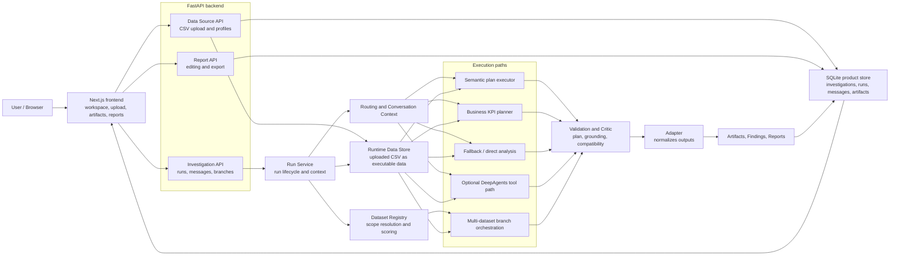

# Analytica

## Overview

Analytica is an analytical workspace for exploring structured data, running KPI-focused analysis, and turning validated results into reusable artifacts and reports.

The system is built around a practical split: natural-language questions are used to understand analytical intent, while deterministic services perform the actual computations. This keeps results reproducible, inspectable, and easier to validate.

## How It Works

Analytica parses a question into an analytical intent: metric, aggregation, grouping, filters, chart request, and dataset scope. The backend then executes the analysis through dataframe and read-only SQL workflows, validates the result, and stores the output as part of an investigation.

## Main Workflow

1. User uploads one or more datasets.
2. The system resolves analytical intent and dataset scope.
3. A deterministic analytical plan is constructed.
4. Analytical execution produces tables, charts, and KPI outputs.
5. Validation checks compare outputs against expected analytical constraints.
6. Results are stored as reusable analytical artifacts.
7. Final reports can be generated from validated outputs.

## Key Capabilities

### Dataset Handling

CSV datasets can be uploaded, profiled, and reused across investigations. Profiles include schema information, metadata summaries, categorical statistics, and numerical summaries.

### Investigation Workspace

Investigations keep questions, runs, artifacts, findings, and reports together. Users can inspect intermediate outputs, continue follow-up analysis, and organize useful results into report sections.

### Deterministic Analytical Execution

The backend supports grouped aggregations, distributions, trend analysis, relationship-style analysis, outlier inspection, and chart-oriented workflows.

### KPI and Business Reasoning

Business-oriented workflows cover profit margin analysis, discount sensitivity, shipping-cost burden, operational inefficiency, and similar KPI scenarios.

### Multi-Dataset Workflows

Analytica supports branch-based comparative reasoning across several datasets. Independent execution branches collect scoped evidence packages which are later combined into comparative summaries.

The multi-dataset layer is designed for scoped comparison and synthesis, not arbitrary warehouse-style joins.

### Artifacts and Reporting

Analytical outputs are stored as reusable artifacts: tables, charts, findings, report sections, TXT exports, and PDF exports.

### Validation and Restricted Execution

The workflow includes plan validation, grounding checks, read-only SQL validation, and restricted Python execution. Runtime controls rely on AST validation, restricted built-ins, limited imports, and tool-level safeguards.

### Configurable Planning

Optional planning providers can be configured through local settings, while the core analytical execution remains deterministic.

## Architecture



The frontend does not compute analytical results directly. It sends requests to the FastAPI backend. The backend creates or updates investigations, resolves datasets, runs analytical logic, validates outputs, stores results, and returns updated investigation state to the frontend.

CSV upload is the main public ingestion path. Uploaded files are stored under the configured upload directory, profiled, and converted into runtime data so that later analytical runs can use them.

## Implementation

The application includes a FastAPI backend and a Next.js frontend.

The backend handles investigation management, dataset upload, runtime execution, artifact storage, report generation, and SQLite-backed persistence. Uploaded CSV datasets are profiled and made available to deterministic analytical workflows.

The frontend includes investigation pages, dataset-management views, upload workflows, chart and table artifacts, follow-up interaction, and report workspace components.

The analytical backend supports:
- deterministic dataframe-style execution;
- dataset scope resolution and dataset registry workflows;
- business-semantic KPI logic for selected schemas;
- read-only dataframe SQL tools;
- restricted dynamic Python execution;
- optional external planning and tool-execution paths.

The repository also includes benchmark notebooks, evaluation outputs, and thesis visualization assets.

## Project Structure

```text
source/api/
  FastAPI app, route registration, investigation routes, data-source routes, report routes.

source/product/
  Main product logic: run service, investigation service, dataset registry,
  planners, validators, executors, adapter, persistence interfaces, reports.

source/product/sqlite/
  SQLite product store implementation.

source/tools/
  Tools for dataframe inspection, SQL validation/querying,
  safe Python analysis, chart helpers, and report artifacts.

source/agent.py
  Optional runtime setup and tool selection.

frontend/
  Next.js application with investigation workspace, upload UI, artifacts,
  report UI, API client, and frontend tests.

notebooks/
  Evaluation and thesis visualization notebooks.

docs/evaluation_outputs/
  Generated benchmark CSV, JSON, and figure outputs.

docs/thesis_figures/
  Figures used by the thesis report.
```

## Setup

### Requirements

- Python 3.12+
- Node.js 22 for the Docker frontend build. Local Node.js 18+ may work for development.
- Docker and Docker Compose for containerized setup.

### Environment

Create a local environment file:

```bash
cp .env.example .env
```

## Running the Application

### Docker Compose

```bash
cp .env.example .env
docker compose up --build
```

Default URLs:

- Frontend: <http://localhost:3000>
- Backend API docs: <http://localhost:8000/docs>
- Health check: <http://localhost:8000/health>

### Local Backend

```bash
python3 -m venv .venv
source .venv/bin/activate
pip install -r requirements.txt
uvicorn source.api.app:app --reload --host 0.0.0.0 --port 8000
```

### Local Frontend

```bash
cd frontend
npm install
npm run dev
```

## Evaluation

The project includes a deterministic benchmark for selected analytical workflows.

Evaluation notebooks:
- notebooks/evaluation_metrics.ipynb
- notebooks/thesis_visualizations.ipynb

Generated outputs:
- docs/evaluation_outputs/

The benchmark covers analytical correctness, KPI handling, visualization generation, follow-up behavior, and multi-dataset workflows.

## Development Notes

### Backend Tests

The compact backend smoke/regression suite contains 28 tests:

```bash
uv run --with pypdf pytest -q tests
```

If dependencies are already installed in a virtual environment, the equivalent pytest command is:

```bash
pytest -q tests
```
